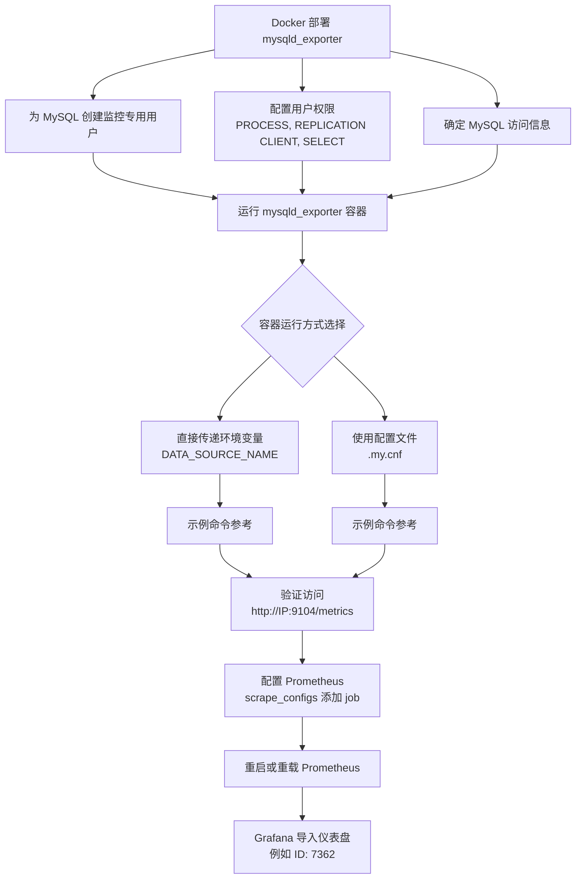

# MySQL Server Exporter

https://github.com/prometheus/mysqld_exporter

通过 Docker 部署 `mysqld_exporter` 来监控 MySQL 数据库是 Prometheus 体系中的常见做法。下面我为你梳理了部署步骤、配置方法以及一些注意事项。

下面是 Docker 部署 `mysqld_exporter` 的主要步骤关系图：



### 🐳 运行 MySQLD Exporter 容器

运行容器时，关键是要让 `mysqld_exporter` 能够连接到你的 MySQL 实例。你有两种主要的方式来提供数据库连接信息：

| 方法                           | 优点                     | 缺点                             | 关键参数/命令                                                                 |
| :----------------------------- | :----------------------- | :------------------------------- | :-------------------------------------------------------------------------- |
| **环境变量 `DATA_SOURCE_NAME`** | 简单直接，一行命令即可     | 密码以明文形式出现在命令历史或日志中 | `-e DATA_SOURCE_NAME="exporter_user:password@(mysql_host:3306)/"`           |
| **配置文件 `.my.cnf`**         | 更安全，避免密码明文暴露   | 需要管理额外的配置文件           | `-v /path/on/host/.my.cnf:/.my.cnf`<br>或 `--config.my-cnf=".my.cnf"` (非Docker) |

你可以根据上述对比选择适合的方式。对应的 Docker 运行命令示例：

**1. 使用环境变量直接传递连接字符串（适合快速测试）**
```bash
docker run -d \
  --name mysqld_exporter \
  --restart=always \
  -p 9104:9104 \
  -e DATA_SOURCE_NAME="exporter:YourPassword123@(your-mysql-host:3306)/" \
  prom/mysqld-exporter
```
*   `your-mysql-host` 可以是 MySQL 服务器的 IP 地址、主机名（若容器能解析）或者 Docker 网络中的容器名称（如果 MySQL 也在同一 Docker 网络）。
*   密码包含特殊字符时可能需要转义。

**2. 使用配置文件（更安全，推荐生产环境使用）**
首先，在宿主机上创建一个 `.my.cnf` 文件，例如 `/path/to/your/mysql-exporter-config/.my.cnf`：
```ini
[client]
user=exporter
password=YourPassword123
host=your-mysql-host
port=3306
```
然后运行容器并挂载该配置文件：
```bash
docker run -d \
  --name mysqld_exporter \
  --restart=always \
  -p 9104:9104 \
  -v /path/to/your/mysql-exporter-config/.my.cnf:/.my.cnf  \
  prom/mysqld-exporter
```

### 🔍 验证 Exporter 是否正常工作

容器运行后，验证它是否能成功采集 MySQL 的指标。
1.  **访问指标端点**：在浏览器或使用 `curl` 访问 `http://your-host-ip:9104/metrics`。你应该能看到大量以 `mysql_` 开头的指标输出。
2.  **检查容器日志**：如果无法访问或看不到数据，查看容器日志通常能发现连接问题。
    ```bash
    docker logs mysqld_exporter
    ```
    常见的错误可能是数据库连接失败（检查用户名、密码、主机地址、端口、网络连通性）或权限不足。

### ⚙️ 配置 Prometheus 抓取

让 Prometheus 服务器能够从 `mysqld_exporter` 抓取数据，需要在 Prometheus 的配置文件 `prometheus.yml` 中添加一个新的 `job`。

```yaml
# 在 prometheus.yml 的 scrape_configs 部分添加
scrape_configs:
  # ... 其他已有的 job 配置 ...
  - job_name: 'mysqld-exporter'   # 任务名称，可自定义
    static_configs:
      - targets: ['your-host-ip:9104']  # 这里填写运行 mysqld_exporter 的主机IP和端口
        labels:
          instance: your-mysql-instance-label # 可自定义一个实例标签，便于识别
```
*   **修改配置后重启 Prometheus** 或向其发送 `SIGHUP` 信号或使用 `HTTP POST` 请求到 `/-/reload` 端点（如果启动了 `--web.enable-lifecycle` 选项）以重载配置。
*   在 Prometheus 的 Web 界面（通常是 `http://your-prometheus-ip:9090/targets`）检查新 `target` 的状态是否为 **UP**。

### 📊 在 Grafana 中可视化监控数据

数据抓取成功后，你可以在 Grafana 中创建仪表盘来可视化监控数据。
1.  **添加数据源**：在 Grafana 中添加 Prometheus 作为数据源，填写正确的 Prometheus 服务器地址。
2.  **导入仪表盘**：
    *   访问 [Grafana 官方仪表盘市场](https://grafana.com/grafana/dashboards/)。
    *   搜索 "MySQL"，例如流行的 MySQL 仪表盘有 **ID 7362** (`MySQL Overview`) 或 **ID 6239**。
    *   在 Grafana 界面中，通过 "+" -> "Import" 输入仪表盘 ID，选择对应的 Prometheus 数据源，即可导入预制的监控面板。

### ⚠️ 注意事项

*   **网络连通性**：这是最常见的问题。确保 `mysqld_exporter` 容器能够通过网络访问到 MySQL 服务器的 **3306** 端口。如果使用 Docker，注意容器间的网络模式（例如 `--network bridge`, `--network host` 或自定义网络）。
*   **安全性**：避免使用高级权限账户（如 `root`）作为 Exporter 用户。生产环境中强烈建议使用配置文件而非环境变量明文设置密码，并妥善设置配置文件的权限（如 `chmod 600 .my.cnf`）。
*   **版本兼容性**：确认你使用的 `mysqld_exporter` 版本与你的 MySQL 或 MariaDB 版本兼容。一般来说，较新的 exporter 版本支持 MySQL >= 5.6 或 MariaDB >= 10.3。
*   **监控多个 MySQL 实例**：一个 `mysqld_exporter` 实例通常监控一个 MySQL 实例。官方代码的 `main` 分支已支持多实例，但可能需要自行编译。更常见的做法是为每个 MySQL 实例部署一个 exporter，然后在 Prometheus 中配置多个抓取目标。

希望这些信息能帮助你顺利完成 Docker 部署。如果有更多问题，欢迎再问我。

## 尝试总结

```sql
CREATE USER 'exporter'@'localhost' IDENTIFIED BY 'XXXXXXXX' WITH MAX_USER_CONNECTIONS 3;
GRANT PROCESS, REPLICATION CLIENT, SELECT ON *.* TO 'exporter'@'localhost';
FLUSH PRIVILEGES;
```

/path/to/mysql_exporter/config/.my.cnf

[client]
host=localhost
port=3306
socket=/var/run/mysqld/mysqld.sock
user=foo
password=bar
[client.server1]
user = bar
password = bar123

chmod 600 /path/to/mysql_exporter/config/.my.cnf

```shell
docker network create my-mysql-network
docker pull prom/mysqld-exporter:latest

docker run -d \
  -p 9104:9104 \
  -v /home/user/user_my.cnf:/.my.cnf:ro \
  --network my-mysql-network  \
  prom/mysqld-exporter:latest
```

```plaintext
- job_name: mysql # To get metrics about the mysql exporter’s targets
    metrics_path: /probe
    params:
    # Not required. Will match value to child in config file. Default value is `client`.
    auth_module: [client.servers]
    static_configs:
    - targets:
        # All mysql hostnames or unix sockets to monitor.
        - server1:3306
        - server2:3306
        - unix:///run/mysqld/mysqld.sock
    relabel_configs:
    - source_labels: [__address__]
        target_label: __param_target
    - source_labels: [__param_target]
        target_label: instance
    - target_label: __address__
        # The mysqld_exporter host:port
        replacement: localhost:9104
```
