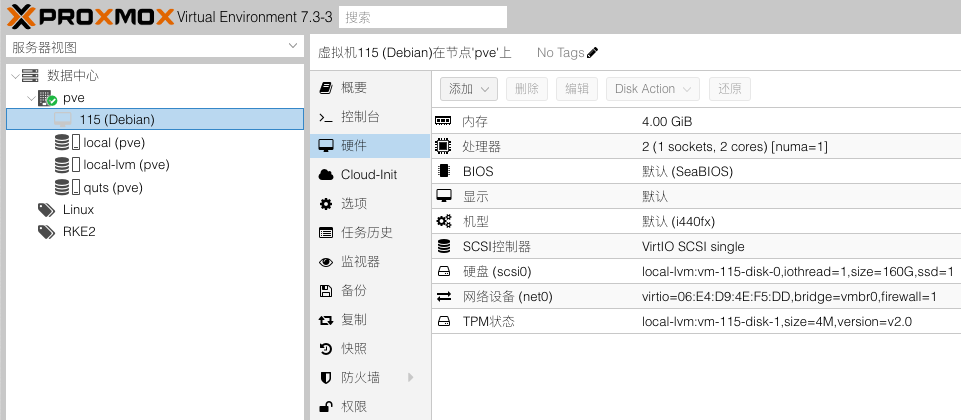
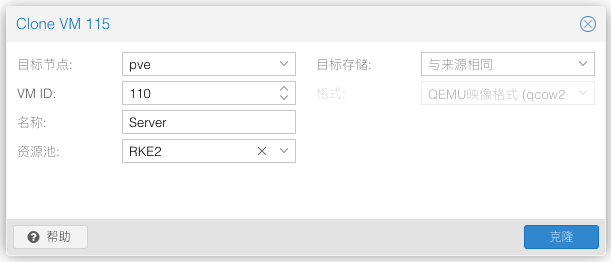

# 基于Rancher搭建k8s集群 (RKE2)

RKE2，也称为 RKE Government，是 Rancher 的下一代 Kubernetes 发行版。

## 搭建步骤 [官方安装手册](https://docs.rke2.io/zh/)

> 假设已经安装好`Proxmox VE`环境

### 准备集群机器

1. 创建`Virtual Machine`模板

    

2. 克隆出集群所需机器

    

3. 修改机器配置

  - VM下`选项-开机自启动`改成`是`

  - 配置固定IP和Mac地址的映射、内网域名

    | Name     | Roles                       | Sub Domain          | IP Address     | Mac Address       | Device  |
    |----------|-----------------------------|---------------------|----------------|-------------------|---------|
    | Server   | master, etcd, control-plane | server.homelab.com  | 192.168.100.50 | B6:F3:B1:2D:C4:BF | C4M8    |
    | Node 1   | worker                      | node1.homelab.com   | 192.168.100.51 | 7A:20:65:60:1F:88 | C8M16   |
    | Node 2   | worker                      | node2.homelab.com   | 192.168.100.52 | FA:FC:19:AE:7A:4D | C8M16   |
    | Node 3   | worker                      | node3.homelab.com   | 192.168.100.53 | EA:EF:E4:E5:72:39 | C8M16G1 |

  - 修改主机名

    ```shell
    # 1.通过hostnamectl设置
    sudo hostnamectl set-hostname nodeX
    # 2.编辑/etc/hosts文件
    sudo vim /etc/hosts
    ```

### Server节点

```shell
su -

curl -sfL https://rancher-mirror.rancher.cn/rke2/install.sh | INSTALL_RKE2_MIRROR=cn sh -

systemctl enable rke2-server.service

systemctl start rke2-server.service

journalctl -u rke2-server -f
```

cat /etc/rancher/rke2/rke2.yaml

```yaml
apiVersion: v1
clusters:
- cluster:
    certificate-authority-data: LS0tLS1CRUdJTiBDRVJUSUZJQ0FURS0tLS0tCk1JSUJlakNDQVIrZ0F3SUJBZ0lCQURBS0JnZ3Foa2pPUFFRREFqQWtNU0l3SUFZRFZRUUREQmx5YTJVeUxYTmwKY25abGNpMWpZVUF4TnpBMU1EY3pOams0TUI0WERUSTBNREV4TWpFMU16UTFPRm9YRFRNME1ERXdPVEUxTXpRMQpPRm93SkRFaU1DQUdBMVVFQXd3WmNtdGxNaTF6WlhKMlpYSXRZMkZBTVRjd05UQTNNelk1T0RCWk1CTUdCeXFHClNNNDlBZ0VHQ0NxR1NNNDlBd0VIQTBJQUJOaURIY21iZHQrdUF6M2RFWWNudVJQbk5zMTZtSkoyMHhxblpKUTUKSEdTODJXQ2tROGtaSW9WUDc4UFhFSDJ5akdTK0h5RWdDUTh0Z2kvdzNZTnlnUGVqUWpCQU1BNEdBMVVkRHdFQgovd1FFQXdJQ3BEQVBCZ05WSFJNQkFmOEVCVEFEQVFIL01CMEdBMVVkRGdRV0JCUVh4RE9RZWF0K0tyMDF4a0R0CkU2RjlHMjRHU2pBS0JnZ3Foa2pPUFFRREFnTkpBREJHQWlFQXZvZE81aXJOQkdpWVdTTFFqSE1DMnN6YjAvZkwKMDVhZXA2VkVSMWVZN1lVQ0lRQ1FUUTJPNklYdFk0RDNpNnpla2lrQjdMNW1VL0NYbElUcWt2enM3ejVHN1E9PQotLS0tLUVORCBDRVJUSUZJQ0FURS0tLS0tCg==
    server: https://127.0.0.1:6443
  name: default
contexts:
- context:
    cluster: default
    user: default
  name: default
current-context: default
kind: Config
preferences: {}
users:
- name: default
  user:
    client-certificate-data: LS0tLS1CRUdJTiBDRVJUSUZJQ0FURS0tLS0tCk1JSUJrekNDQVRpZ0F3SUJBZ0lJQit6VzMvSnI4MWt3Q2dZSUtvWkl6ajBFQXdJd0pERWlNQ0FHQTFVRUF3d1oKY210bE1pMWpiR2xsYm5RdFkyRkFNVGN3TlRBM016WTVPREFlRncweU5EQXhNVEl4TlRNME5UaGFGdzB5TlRBeApNVEV4TlRNME5UaGFNREF4RnpBVkJnTlZCQW9URG5ONWMzUmxiVHB0WVhOMFpYSnpNUlV3RXdZRFZRUURFd3h6CmVYTjBaVzA2WVdSdGFXNHdXVEFUQmdjcWhrak9QUUlCQmdncWhrak9QUU1CQndOQ0FBUmxmdmwwd2dNeVNySjcKenFPK3NVb2NIRUw3djdmditoTXd2WjRRNlc5TWdXZDd6UWk5eGM4UVl1ejREaEN5cEtEUUNoV3kyOHhPM1p3aQpHaStndVBvTG8wZ3dSakFPQmdOVkhROEJBZjhFQkFNQ0JhQXdFd1lEVlIwbEJBd3dDZ1lJS3dZQkJRVUhBd0l3Ckh3WURWUjBqQkJnd0ZvQVVnVkJQdTNoamJjZ25MeEhLK2Njbnc5YmJtNGd3Q2dZSUtvWkl6ajBFQXdJRFNRQXcKUmdJaEFLMllYbXNnb0V1U1JSNHFGRTdCNUxOSGhZVWNueEN4cEFlMTFLbjB3dWJjQWlFQTZHWmVDMWFrVzZmSwp0QjVld0VhSWg1bjFpY3NxclEyNXpucWMvSm4xRFQ4PQotLS0tLUVORCBDRVJUSUZJQ0FURS0tLS0tCi0tLS0tQkVHSU4gQ0VSVElGSUNBVEUtLS0tLQpNSUlCZVRDQ0FSK2dBd0lCQWdJQkFEQUtCZ2dxaGtqT1BRUURBakFrTVNJd0lBWURWUVFEREJseWEyVXlMV05zCmFXVnVkQzFqWVVBeE56QTFNRGN6TmprNE1CNFhEVEkwTURFeE1qRTFNelExT0ZvWERUTTBNREV3T1RFMU16UTEKT0Zvd0pERWlNQ0FHQTFVRUF3d1pjbXRsTWkxamJHbGxiblF0WTJGQU1UY3dOVEEzTXpZNU9EQlpNQk1HQnlxRwpTTTQ5QWdFR0NDcUdTTTQ5QXdFSEEwSUFCTEpkdVhqQ2NqVkFBZkhESHRmU2NIVmhDSEZ2VkVMNDNTRFBxTkRjCkg0U2syNFFqTVY0d1NQaXZGYmJFNkpNT3dmQ1FjMzdmSkdHN3llZjJVUFBUT282alFqQkFNQTRHQTFVZER3RUIKL3dRRUF3SUNwREFQQmdOVkhSTUJBZjhFQlRBREFRSC9NQjBHQTFVZERnUVdCQlNCVUUrN2VHTnR5Q2N2RWNyNQp4eWZEMXR1YmlEQUtCZ2dxaGtqT1BRUURBZ05JQURCRkFpQmNPZHF3TmtjaWZ1Zkd3Z25JTjlLNkJKWnFxdE5kCml4Tkk2V0tJaXRGNWxRSWhBTVhYLy9hdHVNZlZpTTRMcTI1Tnhzekxpb1dhWTlpQnRaZ29EcWc2UDdMRgotLS0tLUVORCBDRVJUSUZJQ0FURS0tLS0tCg==
    client-key-data: LS0tLS1CRUdJTiBFQyBQUklWQVRFIEtFWS0tLS0tCk1IY0NBUUVFSU56MGw4YTZPRFpRVWQ4OFU1cTJqZnltbVREQUJoUElpaG5jcGtvNXljMEhvQW9HQ0NxR1NNNDkKQXdFSG9VUURRZ0FFWlg3NWRNSURNa3F5ZTg2anZyRktIQnhDKzcrMzcvb1RNTDJlRU9sdlRJRm5lODBJdmNYUApFR0xzK0E0UXNxU2cwQW9Wc3R2TVR0MmNJaG92b0xqNkN3PT0KLS0tLS1FTkQgRUMgUFJJVkFURSBLRVktLS0tLQo=
```

cat /var/lib/rancher/rke2/server/node-token

```yaml
server: https://192.168.100.50:9345
token: K10a69dd2406b8b60da7ff092e88d964e5faf067270b1073c71ddec36b30f0cd757::server:62a5d345889ade760ca81c89681b0f03
```

### Worker节点

```shell
su -

curl -sfL https://rancher-mirror.rancher.cn/rke2/install.sh | INSTALL_RKE2_MIRROR=cn INSTALL_RKE2_TYPE="agent" sh -

systemctl enable rke2-agent.service

mkdir -p /etc/rancher/rke2/
vim /etc/rancher/rke2/config.yaml

config.yaml
server: https://<server>:9345
token: <token from server node>

systemctl start rke2-agent.service

journalctl -u rke2-agent -f
```

## 修改节点角色名称

```shell
kubectl label nodes nodeX node-role.kubernetes.io/worker=
```
