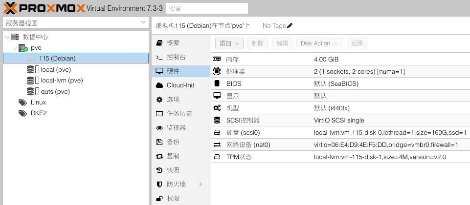
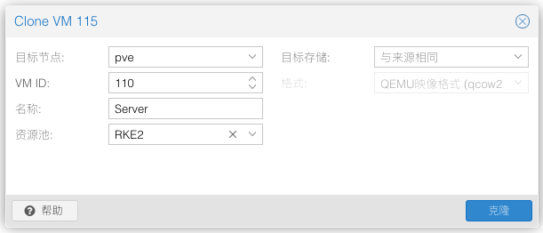

# 准备集群机器

> 假设你已经安装好`Proxmox VE`环境，且装好了一台`Debian`的虚拟机，并完成了最基础的准备和配置工作

## 创建 & 配置

1. 创建`Virtual Machine`模板

    

2. 克隆出集群所需机器

    

3. 修改机器配置

- VM下`选项-开机自启动`改成`是`

- 配置固定IP和Mac地址的映射、内网域名

    | Name     | Roles                       | Sub Domain          | IP Address     | Mac Address       | Device  |
    |----------|-----------------------------|---------------------|----------------|-------------------|---------|
    | Server   | master, etcd, control-plane | server.homelab.com  | 192.168.100.50 | B6:F3:B1:2D:C4:BF | C4M8    |
    | Node 1   | worker                      | node1.homelab.com   | 192.168.100.51 | 7A:20:65:60:1F:88 | C8M16   |
    | Node 2   | worker                      | node2.homelab.com   | 192.168.100.52 | FA:FC:19:AE:7A:4D | C8M16   |
    | Node 3   | worker                      | node3.homelab.com   | 192.168.100.53 | EA:EF:E4:E5:72:39 | C8M16G1 |

- 修改主机名

    ```shell
    # 1.通过hostnamectl设置
    sudo hostnamectl set-hostname nodeX
    # 2.编辑/etc/hosts文件
    sudo vim /etc/hosts
    ```
